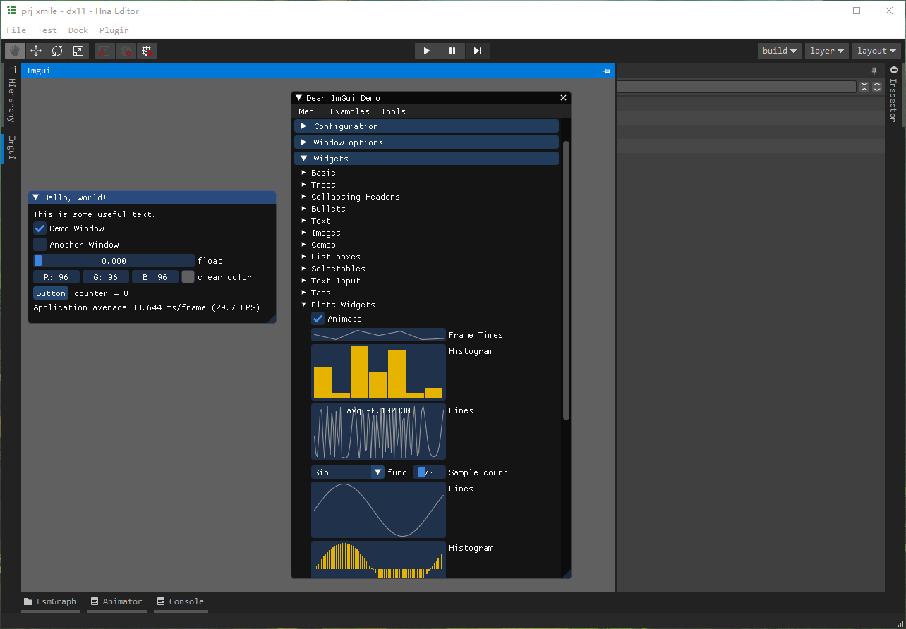
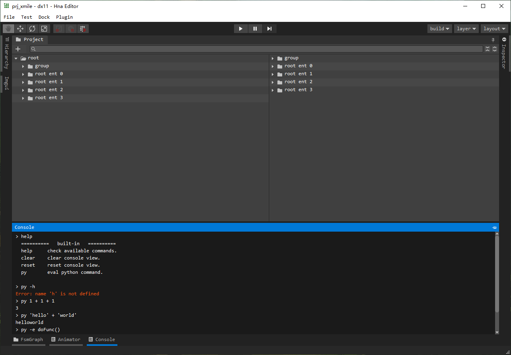
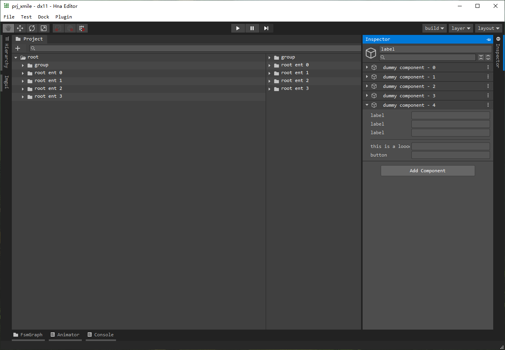

# PySide6-QtAds
Python bindings to [Qt Advanced Docking System](https://github.com/githubuser0xFFFF/Qt-Advanced-Docking-System) for PySide6





## 1. Enter prj folder
```bat
cd <your-path>/HnaEditor/.support/shiboken/qtads
```

## 2. Create and enter `build` folder
```bat
mkdir build
cd build
```

## 3. Configure
```bat
cmake -DCMAKE_BUILD_TYPE=Release ..
```

## 4. Build
```bat
cmake --build . --target install --config Release
```

## 4. Enjoy
```bat
python ../testpkg.py
```