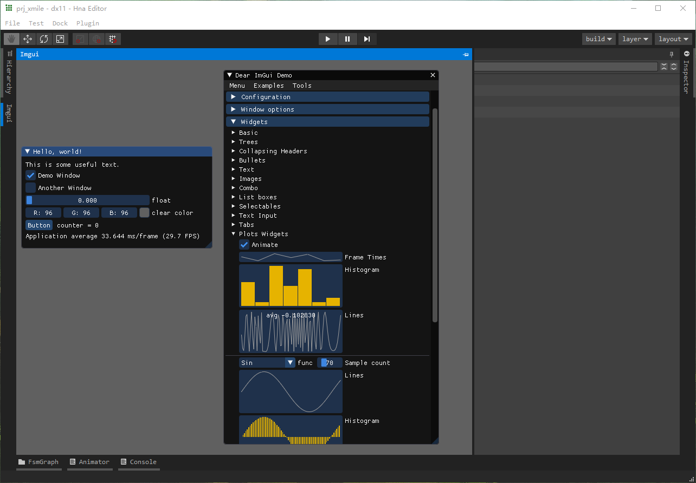

# pyside6_qtads

Python bindings to [Qt Advanced Docking System](https://github.com/githubuser0xFFFF/Qt-Advanced-Docking-System) for PySide6





# requirements

If need compile shiboken prjs like QtAds,

use ↓
```bat
pip install \
    --index-url=http://download.qt.io/official_releases/QtForPython/ \
    --trusted-host download.qt.io \
    shiboken6 pyside6 shiboken6_generator
```
to install shiboken6_generator module.

For details goto [qt doc](https://doc.qt.io/qtforpython/shiboken6/gettingstarted.html).


# build package

## 1. enter prj folder
```bat
cd <your-path>/DearEditor/.support/pyside6_qtads
```

## 2. create and enter `build` folder
```bat
mkdir build
cd build
```

## 3. configure
```bat
cmake -DCMAKE_BUILD_TYPE=Release .. -DADS_VERSION=4.0.2
```

## 4. build
```bat
cmake --build . --target install --config Release
```

## 4. enjoy
```bat
python ../testpkg.py
```