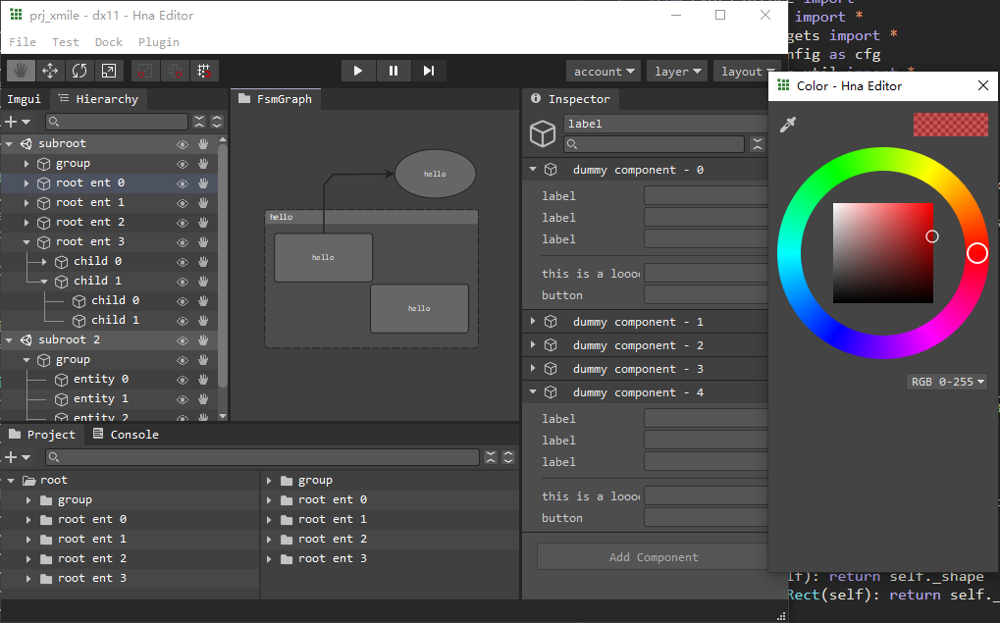
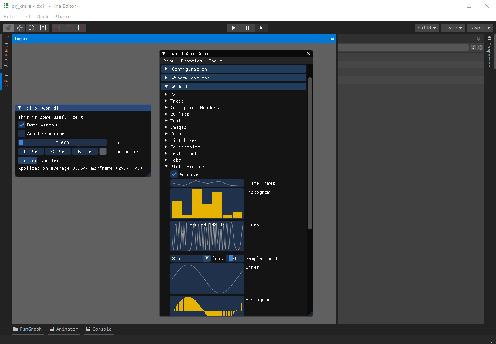
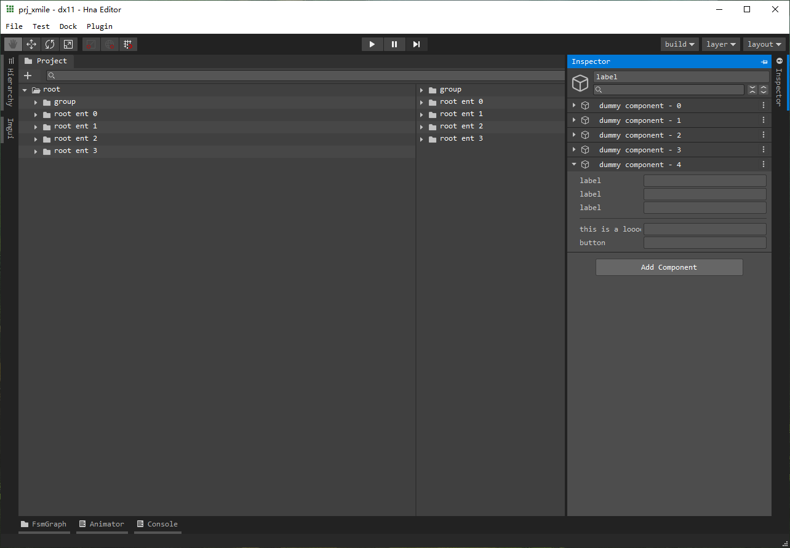

# README

Welcom to DearEditor!

DearEditor is a PySide6 based **WIP** game editor. The aim of DearEditor is to create a open and unite editor solution for all game engines (especially for in-house engines).

## Screenshots





## Requirements
### 1. install python >= 3.9.9

### 2. install required python packages
```bat
> pip install -r requirements.txt
```
or simply (need do setup work first)
```bat
> dear install
```

## Setup
1. Add `<your-path>/DearEditor/bin` into env-variables path.
2. Find `<your-path>/DearEditor/bin/dear` file (aka dear-bin later).
3. Modify `idedir` and `pybin` path in dear-bin with your actual path.

## Enjoy and run
use ↓

```bat
> dear
```
to see welcome and help info.

use ↓

```bat
> dear ide
```
to raise dear editor ide.

use ↓

```bat
> dear list
```
to check all available commands.
