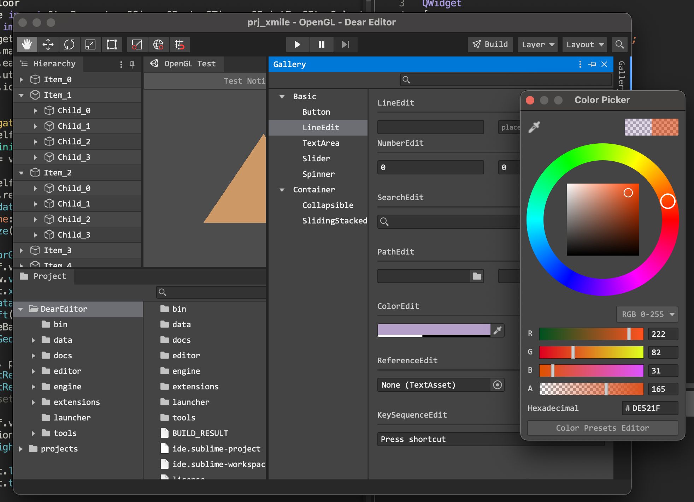

# README

Welcom to DearEditor!

DearEditor is a PySide6 based **WIP** game editor. The aim of DearEditor is to create a open and unite editor solution for all game engines (especially for in-house engines).




## Requirements
### 1. install python >= 3.9.9

### 2. install required python packages
```bat
> pip install -r requirements.txt
```
or simply (need do setup work first)
```bat
> dear install
```

## Setup
1. Add `<your-path>/DearEditor/bin` into env-variables path.
2. Find `<your-path>/DearEditor/bin/dear.bat` file (aka hna-bin later).
3. Modify `idedir` and `pybin` path in hna-bin with your actual path.

## Enjoy and run
use ↓

```bat
> dear
```
to see welcome and help info.

use ↓

```bat
> dear ide
```
to raise hna editor ide.

## Shiboken prj notes
If need compile shiboken prjs like QtAds,

use ↓
```bat
pip install \
    --index-url=http://download.qt.io/official_releases/QtForPython/ \
    --trusted-host download.qt.io \
    shiboken6 pyside6 shiboken6_generator
```
to install shiboken6_generator module.

For details goto [qt doc](https://doc.qt.io/qtforpython/shiboken6/gettingstarted.html).